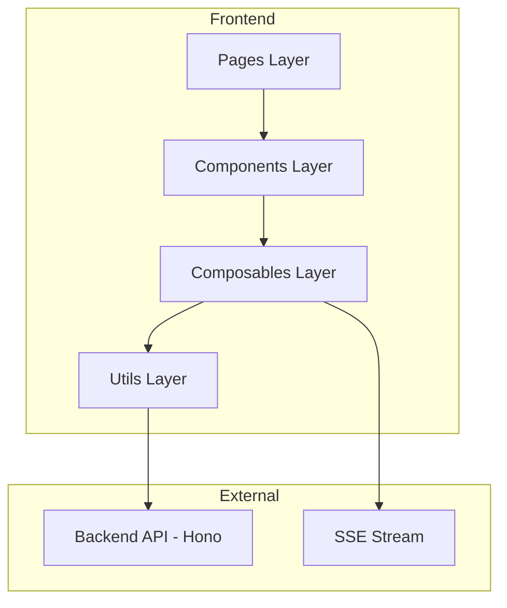
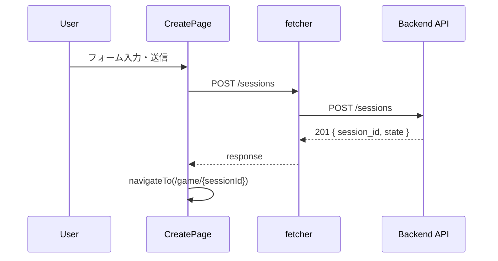
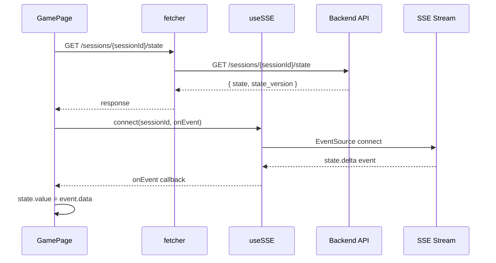
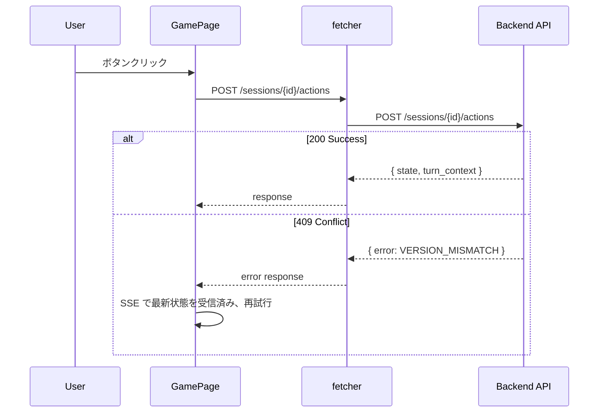

# Design Document: No Thanks! Frontend

## Overview

**Purpose**: No Thanks! ボードゲームの Web フロントエンドを提供し、リアルタイムなマルチプレイ体験を実現する。

**Users**: オンラインでボードゲームを楽しみたいプレイヤー（2〜7名）がセッション作成、ゲーム参加、アクション実行を行う。

**Impact**: 既存のバックエンド API と SSE インフラを活用し、新規 SPA をゼロから構築する。

### Goals
- リアルタイム状態同期による遅延のないゲーム体験
- 型安全な API 通信 (hono/client)
- レスポンシブ UI (モバイル/タブレット/デスクトップ)
- 日本語でのエラーメッセージ表示

### Non-Goals
- サーバーサイドレンダリング (SSR) — SPA モードで運用
- 多言語対応 (i18n) — 初期リリースは日本語のみ
- ユーザー認証 — 現時点では匿名プレイ
- ゲーム履歴の永続化 — バックエンドの In-Memory Store に依存

## Architecture

### Architecture Pattern & Boundary Map



**Architecture Integration**:
- **Selected pattern**: Layered Architecture (Pages → Components → Utils)
- **Domain/feature boundaries**: 
  - Pages: ルーティング、状態管理、API 呼び出し
  - Components: プレゼンテーションロジック（Props/Events のみ）
  - Composables: SSE 接続管理のみ（再接続ロジックのカプセル化）
  - Utils: API クライアント (`fetcher`) とユーティリティ
- **Existing patterns preserved**: Nuxt 3 ファイルベースルーティング、hc クライアント
- **New components rationale**: API 呼び出しは Page で直接実行、Composable は SSE のみ
- **Steering compliance**: TypeScript strict mode、Tailwind CSS、Vitest

### Technology Stack

| Layer | Choice / Version | Role in Feature | Notes |
|-------|------------------|-----------------|-------|
| Frontend Framework | Nuxt 3 + Vue 3 | SPA 構築、ルーティング | SSR 無効 |
| Styling | Tailwind CSS | ユーティリティファースト CSS | 既存設定を継続 |
| API Client | hono/client (hc) | 型安全な API 通信 | `@hc` エイリアス経由 |
| State Management | Vue Composables | リアクティブ状態管理 | Pinia 不使用 |
| Real-time | EventSource (native) | SSE 接続 | カスタム再接続ロジック |
| Testing | Vitest | ユニット/統合テスト | コロケーション |

## System Flows

### ゲームセッション作成フロー



### ゲーム状態同期フロー



### プレイヤーアクションフロー



## Requirements Traceability

| Requirement | Summary | Components | Interfaces | Flows |
|-------------|---------|------------|------------|-------|
| 1.1-1.6 | セッション作成 | CreateSessionPage, SessionForm | fetcher (POST /sessions) | セッション作成フロー |
| 2.1-2.6 | ゲーム画面表示 | GamePage, GameBoard, PlayerPanel | fetcher (GET /state) | 状態同期フロー |
| 3.1-3.6 | リアルタイム同期 | GamePage, useSSE | EventSource | 状態同期フロー |
| 4.1-4.7 | アクション実行 | GamePage, ActionPanel | fetcher (POST /actions) | アクションフロー |
| 5.1-5.4 | ルールヒント | GamePage, HintPanel | fetcher (GET /hint) | - |
| 6.1-6.5 | 結果表示 | GamePage, ResultsPanel | fetcher (GET /results) | - |
| 7.1-7.3 | レスポンシブ UI | 全コンポーネント | Tailwind breakpoints | - |
| 8.1-8.5 | エラーハンドリング | ErrorDisplay, errorMessages | - | - |

## Components and Interfaces

### Summary Table

| Component | Domain/Layer | Intent | Req Coverage | Key Dependencies | Contracts |
|-----------|--------------|--------|--------------|------------------|-----------|
| CreateSessionPage | Pages | セッション作成画面 | 1.1-1.6 | fetcher (P0) | - |
| GamePage | Pages | ゲーム画面 | 2-6 | fetcher (P0), useSSE (P0) | - |
| SessionForm | Components | ルーム作成フォーム | 1.1-1.4 | - | Props, Events |
| GameBoard | Components | 中央ゲーム盤面 | 2.2-2.5 | - | Props |
| PlayerPanel | Components | プレイヤー情報パネル | 2.3, 2.4 | - | Props |
| ActionPanel | Components | アクションボタン | 4.1-4.7 | - | Props, Events |
| HintPanel | Components | ルールヒント表示 | 5.1-5.4 | - | Props, Events |
| ResultsPanel | Components | 結果表示 | 6.1-6.5 | - | Props, Events |
| ErrorDisplay | Components | エラーメッセージ表示 | 8.1-8.5 | - | Props, Events |
| useSSE | Composables | SSE 接続管理 | 3.1-3.6 | - | Service, State |
| errorMessages | Utils | エラーコード変換 | 8.5 | - | - |

### Composables Layer

#### useSSE

| Field | Detail |
|-------|--------|
| Intent | SSE 接続を管理し、イベントをコールバックで通知する |
| Requirements | 3.1, 3.2, 3.3, 3.4, 3.5, 3.6 |

**Responsibilities & Constraints**
- EventSource 接続の確立・切断
- 自動再接続 (exponential backoff)
- Last-Event-ID による再送サポート
- 接続状態の公開

**Dependencies**
- External: EventSource — ブラウザネイティブ API (P0)

**Contracts**: Service [x] / State [x]

##### Service Interface
```typescript
interface UseSSEOptions {
  /** SSE イベント受信時のコールバック */
  onEvent: (event: SSEEvent) => void;
  /** 接続エラー時のコールバック */
  onError?: (error: Error) => void;
  /** 再接続時のコールバック */
  onReconnect?: () => void;
}

interface UseSSEReturn {
  /** SSE 接続を開始 */
  connect: (sessionId: string) => void;
  /** SSE 接続を切断 */
  disconnect: () => void;
  /** 接続状態 */
  connectionState: Ref<'disconnected' | 'connecting' | 'connected' | 'reconnecting'>;
  /** 最後に受信したイベント ID */
  lastEventId: Ref<string | null>;
}

interface SSEEvent {
  id: string;
  event: 'state.delta' | 'state.final' | 'keepalive';
  data: unknown;
}
```

##### State Management
- **State model**: 接続状態を `ref` で管理
- **Concurrency**: イベントは受信順に処理、再接続時に Last-Event-ID で未取得分を再送

**Implementation Notes**
- Integration: `onUnmounted` で確実に disconnect を呼び出す
- Validation: sessionId が空の場合は接続しない
- Risks: ネットワーク不安定時の再接続ループ → 最大リトライ回数を設定

### Components Layer

#### Base Component Props

```typescript
/** 基底 UI パネル Props */
interface BaseUIPanelProps {
  /** CSS クラス (Tailwind) */
  class?: string;
}
```

---

#### SessionForm

| Field | Detail |
|-------|--------|
| Intent | ルーム作成フォームを提供する（最大プレイヤー人数を選択） |
| Requirements | 1.1, 1.3, 1.4 |

**Contracts**: Props [x] / Events [x]

```typescript
interface SessionFormProps extends BaseUIPanelProps {
  /** 送信中状態 */
  isSubmitting: boolean;
}

interface SessionFormEmits {
  /** フォーム送信イベント（最大プレイヤー人数を送出） */
  (e: 'submit', maxPlayers: number): void;
}
```

**Implementation Notes**
- Validation: プレイヤー人数は 2〜7 の範囲で選択
- UI: プレイヤー人数選択ボタン（2〜7 人）、デフォルト 3 人
- Risks: なし（シンプルな人数選択のみ）

---

#### GameBoard

| Field | Detail |
|-------|--------|
| Intent | ゲーム盤面（中央カード、ポット）を表示する |
| Requirements | 2.2 |

**Contracts**: Props [x]

```typescript
interface GameBoardProps extends BaseUIPanelProps {
  /** 中央のカード番号 (null = カードなし) */
  cardInCenter: number | null;
  /** 中央ポットのチップ数 */
  centralPot: number;
  /** ゲームフェーズ */
  phase: 'setup' | 'running' | 'completed';
}
```

---

#### PlayerPanel

| Field | Detail |
|-------|--------|
| Intent | 各プレイヤーの情報を表示する |
| Requirements | 2.3, 2.4 |

**Contracts**: Props [x]

```typescript
interface PlayerPanelProps extends BaseUIPanelProps {
  /** プレイヤー情報 */
  player: PlayerSummary;
  /** 所持チップ数 */
  chips: number;
  /** 獲得済みカード */
  cards: number[];
  /** 現在の手番かどうか */
  isCurrentTurn: boolean;
  /** 自分自身かどうか */
  isSelf: boolean;
}

interface PlayerSummary {
  id: string;
  displayName: string;
}
```

---

#### ActionPanel

| Field | Detail |
|-------|--------|
| Intent | アクションボタンを提供し、ユーザー操作を処理する |
| Requirements | 4.1, 4.2, 4.5, 4.7 |

**Contracts**: Props [x] / Events [x]

```typescript
interface ActionPanelProps extends BaseUIPanelProps {
  /** 自分の手番かどうか */
  isMyTurn: boolean;
  /** 所持チップ数 */
  myChips: number;
  /** アクション送信中かどうか */
  isSubmitting: boolean;
}

interface ActionPanelEmits {
  /** チップを置くアクション */
  (e: 'placeChip'): void;
  /** カードを取るアクション */
  (e: 'takeCard'): void;
}
```

---

#### HintPanel

| Field | Detail |
|-------|--------|
| Intent | ルールヒントを表示する |
| Requirements | 5.2, 5.3, 5.4 |

**Contracts**: Props [x] / Events [x]

```typescript
interface HintPanelProps extends BaseUIPanelProps {
  /** ヒント情報 */
  hint: RuleHint | null;
  /** 表示状態 */
  isVisible: boolean;
  /** ローディング状態 */
  isLoading: boolean;
}

interface HintPanelEmits {
  /** 表示トグル */
  (e: 'toggle'): void;
}
```

---

#### ResultsPanel

| Field | Detail |
|-------|--------|
| Intent | ゲーム結果を表示する |
| Requirements | 6.2, 6.3, 6.4, 6.5 |

**Contracts**: Props [x] / Events [x]

```typescript
interface ResultsPanelProps extends BaseUIPanelProps {
  /** 最終結果 */
  results: GameResults;
}

interface ResultsPanelEmits {
  /** 新しいゲームを開始 */
  (e: 'newGame'): void;
}
```

---

#### ErrorDisplay

| Field | Detail |
|-------|--------|
| Intent | エラーメッセージを表示する |
| Requirements | 8.1, 8.2, 8.3, 8.4, 8.5 |

**Contracts**: Props [x] / Events [x]

```typescript
interface ErrorDisplayProps extends BaseUIPanelProps {
  /** エラー情報 */
  error: ApiError | null;
}

interface ErrorDisplayEmits {
  /** 閉じる */
  (e: 'dismiss'): void;
  /** リトライ */
  (e: 'retry'): void;
}
```

### Utils Layer

#### errorMessages

| Field | Detail |
|-------|--------|
| Intent | エラーコードを日本語メッセージに変換する |
| Requirements | 8.5 |

```typescript
/** エラーコードから日本語メッセージへのマッピング */
const errorMessages: Record<string, string> = {
  SESSION_NOT_FOUND: 'セッションが見つかりません。',
  PLAYER_COUNT_INVALID: 'プレイヤー数は2〜7人である必要があります。',
  DUPLICATE_PLAYER_ID: 'プレイヤーIDが重複しています。',
  VERSION_MISMATCH: '状態が更新されました。再度お試しください。',
  RESULT_NOT_READY: 'ゲームがまだ終了していません。',
  INSUFFICIENT_CHIPS: 'チップが不足しています。',
  NOT_YOUR_TURN: 'あなたの手番ではありません。',
  NETWORK_ERROR: 'ネットワーク接続を確認してください。',
};

/** エラーコードから日本語メッセージを取得 */
function getErrorMessage(code: string): string;
```

## Data Models

### Domain Model

ゲーム状態はバックエンドの `GameSnapshot` 型をそのまま使用する。フロントエンド固有の状態は Composables 内の `ref` で管理。

### Data Contracts & Integration

**API Data Transfer**

バックエンドの型定義 (`hc/index.d.ts`) をそのまま使用:
- `GameSnapshot`: ゲーム状態の完全な情報
- `PlayerSummary`: プレイヤー基本情報
- `ScoreSummary`: 最終結果
- `RuleHint`: ルールヒント

**SSE Event Schema**

```typescript
interface SSEStateEvent {
  id: string;
  event: 'state.delta' | 'state.final';
  data: {
    state: GameSnapshot;
    state_version: string;
  };
}

interface SSEKeepaliveEvent {
  id: string;
  event: 'keepalive';
  data: null;
}
```

## Error Handling

### Error Strategy

- **Fail Fast**: API エラーは即座にユーザーに通知
- **Graceful Degradation**: SSE 切断時は手動リフレッシュ機能を提供
- **User Context**: 日本語でアクション可能なエラーメッセージ

### Error Categories and Responses

**User Errors (4xx)**
- 404: セッション不存在 → ホームへの導線を提供
- 422: バリデーションエラー → フィールドレベルでエラー表示
- 409: 状態競合 → 自動リトライ後に通知

**System Errors (5xx)**
- 500: サーバーエラー → 汎用エラーメッセージ + リトライ導線

**Network Errors**
- 接続エラー → ネットワーク確認メッセージ
- タイムアウト → リトライ導線

## Testing Strategy

### Unit Tests
- `useSessionCreate`: セッション作成成功/失敗、バリデーション
- `useGameState`: 状態初期化、更新、フェーズ計算
- `useSSE`: 接続/切断/再接続ロジック
- `useGameAction`: アクション送信、409 リトライ
- `errorMessages`: コードからメッセージ変換

### Integration Tests
- セッション作成 → ゲーム画面遷移フロー
- SSE 接続 → 状態更新反映
- アクション実行 → 状態同期

### E2E Tests (将来)
- フルゲームフロー (作成 → プレイ → 完了)

## Performance & Scalability

### Target Metrics
- 初期ロード: < 3秒 (FCP)
- SSE イベント反映: < 100ms
- アクションレスポンス: < 500ms

### Optimization Techniques
- Nuxt SPA モード: 静的アセットのみ配信
- SSE keep-alive: 接続維持オーバーヘッド最小化
- 状態更新: 差分のみ反映 (delta イベント)
