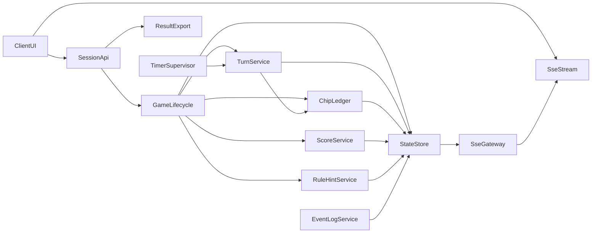
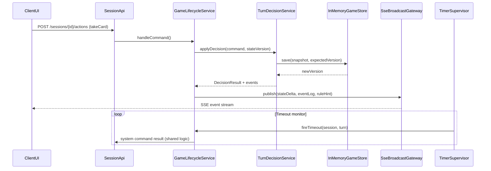

# Geschenkt Board Game Design

## Overview

Geschenkt Game Engine は Hono/TypeScript 上で稼働するターン制ゲーム管理サービスであり、今回の設計ではユーザー指定に合わせてプロセス内メモリのみで状態を保持し、Server-Sent Events (SSE) によるリアルタイム可視化を行う。HTTP API はプレイヤー登録やアクション送信を受け付け、SSE ストリームは状態・ログ・ルールヘルプを即時に配信する。履歴とスコアはサーバ稼働中は常時参照でき、任意タイミングで CSV/JSON としてエクスポートできる。

**Purpose**: Geschenkt のセットアップ、ターン進行、強制取得、得点計算、ログ表示を自動化し、ルールヘルプを付与する。
**Users**: 部屋ホストとプレイヤーが HTTP/SSE 経由で部屋を管理し、観戦者も同じ SSE を購読して状況把握する。
**Impact**: 既存の単純な API から、SSE/メモリストア/ルールヘルプ/エクスポートを備えたゲームエンジンへ拡張する。

### Goals

- ルール準拠のセットアップ・ターン進行・スコアリングを一貫提供。
- SSE によるリアルタイム表示とログ共有。
- ルールヘルプとイベント履歴エクスポートでプレイヤー支援と監査を実現。

### Non-Goals

- プロセスをまたぐ水平スケールや永続 DB。
- AI プレイヤー・ボット。
- クライアント UI 実装詳細。

## Architecture

### Existing Architecture Analysis

- 現状は Hono ルートと OpenAPI 生成のみ、状態管理や push 配信は未導入。
- ステアリングファイルは存在しないため、一般的なクリーンアーキテクチャ規範に基づき境界を定義する。
- 単一 Node プロセス前提。今後の拡張余地を残すためポート/アダプタ構造を採用する。

### Architecture Pattern & Boundary Map

- **Pattern**: Hexagonal。`GameLifecycleService` を中心に、HTTP アダプタ、SSE アダプタ、メモリリポジトリ、タイマー監視、ルールヘルプサービスをポートとして接続。
- **Boundaries**: Interface layer (controllers/SSE) ↔ Domain services ↔ Infrastructure (InMemory store, timers)。
- **New components**: `RuleHintService`, `SseBroadcastGateway`, `InMemoryGameStore`, `ResultExportService` を追加して要件 5.x を満たす。
- **Compliance**: TypeScript 型安全を維持し、依存は UI → Controllers → Domain → Infrastructure の一方向。



### Technology Stack

| Layer                    | Choice / Version                       | Role in Feature                      | Notes                                                |
| ------------------------ | -------------------------------------- | ------------------------------------ | ---------------------------------------------------- |
| Frontend / CLI           | Browser EventSource + REST client      | SSE 購読と HTTP コマンド送信         | 実装例は設計対象外だが API 契約を定義                |
| Backend / Services       | Hono 4.x + TypeScript 5.8              | ルート定義、バリデーション、DI       | 既存 stack を継続                                    |
| Data / Storage           | Process memory (`InMemoryGameStore`)   | セッション状態とログを保持           | プロセス生存中のみ保証、セッション終了まで解放しない |
| Messaging / Events       | Server-Sent Events (HTML5 EventSource) | 状態・ログ・ルールヘルプの push 配信 | Last-Event-ID で再送サポート                         |
| Infrastructure / Runtime | Node.js 20 + pm2/containers            | 実行・監視                           | Graceful shutdown 時は進行中セッションを Export する |

## System Flows



- SSE イベントは `state.delta`, `event.log`, `rule.hint`, `system.error` の 4 種類。`Last-Event-ID` を指定すると未取得イベントを再送する。
- ログエクスポートは `GET /sessions/{id}/logs/export.csv` で即時生成し、クライアント側で保存する。

## Requirements Traceability

| Requirement | Summary                      | Components                                            | Interfaces                                                               | Flows                        |
| ----------- | ---------------------------- | ----------------------------------------------------- | ------------------------------------------------------------------------ | ---------------------------- |
| 1.1-1.5     | 公平なセットアップ           | GameLifecycleService, DeckService, InMemoryGameStore  | POST /sessions                                                           | Setup sequence               |
| 2.1-2.5     | ターン進行/強制取得          | TurnDecisionService, TimerSupervisor, ChipLedger      | POST /sessions/{id}/actions                                              | Main sequence + Timeout loop |
| 3.1-3.5     | チップ管理                   | ChipLedger, GameLifecycleService                      | 同上                                                                     | Main sequence                |
| 4.1-4.5     | 終局・スコア・結果表示       | ScoreService, ResultExportService, EventLogService    | POST /sessions/{id}/finish, GET /sessions/{id}/results, GET /logs/export | Score/Export flow            |
| 5.1-5.5     | 状態表示・ログ・ルールヘルプ | SseBroadcastGateway, RuleHintService, EventLogService | GET /sessions/{id}/stream, GET /logs                                     | SSE stream                   |

## Components and Interfaces

| Component             | Domain/Layer | Intent                                     | Req Coverage | Key Dependencies (P0/P1)                   | Contracts     |
| --------------------- | ------------ | ------------------------------------------ | ------------ | ------------------------------------------ | ------------- |
| GameSessionController | Interface    | HTTP 入口 (setup/join/actions/logs/export) | 1.x-5.x      | GameLifecycleService (P0)                  | REST          |
| SseBroadcastGateway   | Interface    | SSE 接続管理と配信                         | 2.x,5.x      | EventLogService (P0), RuleHintService (P1) | SSE           |
| GameLifecycleService  | Domain       | セッション状態遷移オーケストレーション     | 1.x,2.1,4.1  | InMemoryGameStore (P0), DeckService (P1)   | Service       |
| TurnDecisionService   | Domain       | コマンド適用と強制行動                     | 2.x,3.x      | ChipLedger (P0), InMemoryGameStore (P0)    | Command       |
| ChipLedger            | Domain       | チップ残量制御                             | 3.x          | InMemoryGameStore (P0)                     | Ledger        |
| ScoreService          | Domain       | 終局スコア計算                             | 4.x          | InMemoryGameStore (P0)                     | Score API     |
| RuleHintService       | Domain       | ルール要約生成                             | 5.4          | InMemoryGameStore (P0)                     | Hint provider |
| EventLogService       | Infra        | ログ整形・保存・エクスポート               | 5.2,5.5      | InMemoryGameStore (P0)                     | Query/export  |
| InMemoryGameStore     | Infra        | プロセス内状態保存                         | All          | Mutex库 (internal)                         | Persistence   |
| TimerSupervisor       | Infra        | ターン制限監視                             | 2.5          | InMemoryGameStore (P0)                     | Timer         |
| ResultExportService   | Infra        | CSV/JSON 出力                              | 4.5,5.5      | EventLogService (P0)                       | Export        |

### Interface Layer

#### GameSessionController

| Field        | Detail                                                                     |
| ------------ | -------------------------------------------------------------------------- |
| Intent       | HTTP リクエスト (setup/join/action/state/logs/export) の検証とサービス委譲 |
| Requirements | 1.x-5.x                                                                    |

- Zod スキーマで `playerCount`, `commandId`, `stateVersion`, `exportFormat` を検証。
- エクスポート API: `GET /sessions/:id/logs/export.(csv|json)` で `Content-Disposition` を付与。
- SSE 登録は `GET /sessions/:id/stream` で EventSource を開始し、`Last-Event-ID` をヘッダから取り出してリプレイを依頼。

#### SseBroadcastGateway

- 複数クライアントの `Response` を保持し、`EventEmitter` 経由で push。
- メッセージ形式:

```json
{
  "id": "turn-23-log-2",
  "event": "event.log",
  "data": { "turn": 23, "actor": "p2", "action": "placeChip", "chips": 3 }
}
```

- 再接続時は `EventLogService` から `id` 以降のログを再送し、`state.delta` を最新状態で送る。

### Domain Layer

#### GameLifecycleService

- DeckService で 9 枚除外し、`excludedCards` は `hidden` 配列として保持。
- セッション状態: `{ phase, deck, discardHidden, turnState, hands, chips, centralPot }`。
- 2〜7 名の検証を行い、違反時は 422 と理由 (`PLAYER_COUNT_INVALID`) を返す。

#### TurnDecisionService

- `stateVersion` 不一致時は 409 を返す。セッションごとのミューテックスで直列化。
- `commandId` で冪等性を保証し、`processedCommands` map を持つ。
- タイムアウト命令は `playerId = 'system'` としてログに残し SSE でも通知。

#### ChipLedger

- `chips[playerId]` を操作し、0 未満にならないよう検証。
- `centralPot` 更新時に次プレイヤーへ通知するイベントを返却。

#### ScoreService

- 手札ソート＆連番グループ化で最小値のみ集計。
- 同点時は `remainingChips` で順位決定。
- 結果を `ScoreSummary` として `ResultExportService` へ渡し、SSE `state.final` を送信。

#### RuleHintService

- 入力: `cardInCenter`, `centralPot`, `chips[playerId]`, `deckRemaining`。
- 出力: `{ text: string, emphasis: 'warning' | 'info' }`。
- 例: "カード 28 は 27 を所持していれば 1 点のみ" など、現在状態に依存するヒントを SSE `rule.hint` と HTTP `/sessions/:id/hint` で返却。

### Infrastructure Layer

#### InMemoryGameStore

```ts
interface SessionEnvelope {
  version: string; // sha1(snapshot)
  snapshot: GameSnapshot;
  eventLog: EventLogEntry[];
  mutex: Mutex;
}
```

- `Map<string, SessionEnvelope>` を保持し、`get`, `save`, `appendLog`, `listAfter(eventId)` を提供。
- TTL は設けず、セッション終了後も管理者が削除するまで保持（要件4.5）。

#### EventLogService

- `EventLogEntry` には `id`, `turn`, `actor`, `action`, `chipsDelta`, `timestamp`, `details`。
- `append(entry)` で `eventLog` 配列へ push、SSE へ forward。
- `exportCsv(sessionId)` でヘッダ付き CSV を生成し、`ResultExportService` が HTTP レスポンスへ書き込む。

#### ResultExportService

- `ScoreSummary` と `eventLog` を CSV/JSON に整形。
- SSE / HTTP 双方から呼ばれ、結果確認画面がダウンロードできるようにする。

#### TimerSupervisor

- `setTimeout` ベースのタイマーキューを持ち、セッション envelope に `deadline` とキャンセルハンドルを記録。
- プロセス停止時は再登録できないため、起動時に `turnState.deadline` を走査して再セットするフックを提供。

## Data Models

### Domain Model

- `GameSession`: `id`, `phase`, `players[]`, `turnState`, `deck`, `discardHidden`, `hands`, `chips`, `centralPot`, `commandHistory`, `settings`。
- `EventLogEntry`: `id`, `turn`, `actor`, `action`, `context`, `timestamp`。
- `ScoreSummary`: `placements[]`, `tieBreak`。
- `RuleHint`: `text`, `emphasis`, `generatedAt`, `turn`。

### Logical Data Model

- プロセス内: `Map<sessionId, SessionEnvelope>`。
- `SessionEnvelope.eventLog` は配列、`eventId` は `turn-<n>-<seq>` 形式。
- `processedCommands` は `Set` で保持し、冪等判定に利用。
- 連番ログ書き込みはシングルスレッドのため一貫性を保てる。

### Data Contracts & Integration

- HTTP JSON は snake_case。例: `state_version`, `central_pot`。
- SSE イベント例:

```json
id: turn-12-log-1
event: event.log
data: {"turn":12,"actor":"p1","action":"placeChip","chips":8}
```

- ルールヘルプ API: `GET /sessions/:id/hint` → `{ hint: RuleHint, generated_from_version: string }`。
- ログエクスポート: `text/csv` (UTF-8) or `application/json`。

## Error Handling

- 422: プレイヤー数・コマンド検証失敗 (`reasonCode` 付き)。
- 409: `stateVersion` 不一致。
- 404: セッション未存在（再接続時も使用）。
- 503: サーバ停止準備などで新規セッション受け付け不可。
- SSE error: 接続切断時 `system.error` イベントを送信、クライアントは EventSource 再作成。

## Monitoring

- `action_processing_ms`, `mutex_wait_ms`, SSE 接続数、エクスポート実行回数をロギング。
- Structured log で `sessionId`, `turn`, `commandId`, `result`, `version` を出力。

## Testing Strategy

- Unit: DeckService のカード除外、RuleHintService のヒント生成、ChipLedger の残量制約、ScoreService の連番処理。
- Integration: HTTP + InMemory store を通じたセットアップ→ターン→終了、SSE stream 復元 (`Last-Event-ID`)、タイムアウト強制。
- E2E: 2〜4 人のフルゲーム、チップ枯渇状態→強制取得、ログエクスポート。
- Performance: 50 セッション同時操作での mutex 待ち時間、SSE 500 クライアント broadcast、エクスポート生成時間。

## Security Considerations

- HTTP/SSE で共通のセッショントークンとプレイヤー署名を検証。
- SSE ID 偽装防止のため `SessionApi` で署名済みトークンを発行し、`SseBroadcastGateway` で検証。
- メモリ上の状態はプロセス境界外に露出しないが、エクスポートは `Content-Disposition` を強制して不要なキャッシュを避ける。

## Performance & Scalability

- 単一プロセス前提のため、利用者数が増えた場合はセッションごとに `InMemoryGameStore` を別プロセスへ振り分けるプランを `research.md` に記録。
- SSE は `keepAlive` コメントを 15s 間隔で送信し、アイドル切断を防止。
- TimerSupervisor は Node.js `setTimeout` を使用し、プロセス復帰時に最長 1 秒のグレースで再登録する。

## Supporting References

- 詳細な比較・代替案は `research.md` を参照。EOF
