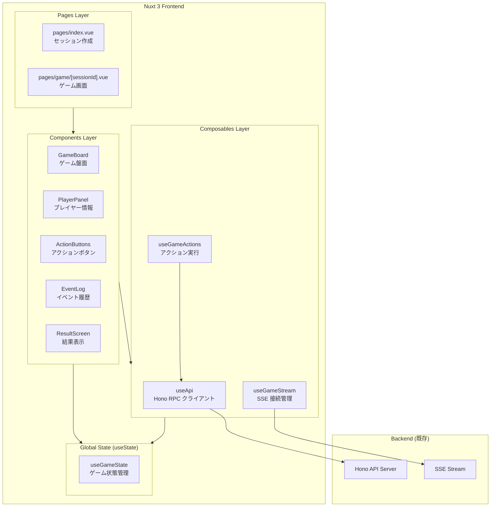
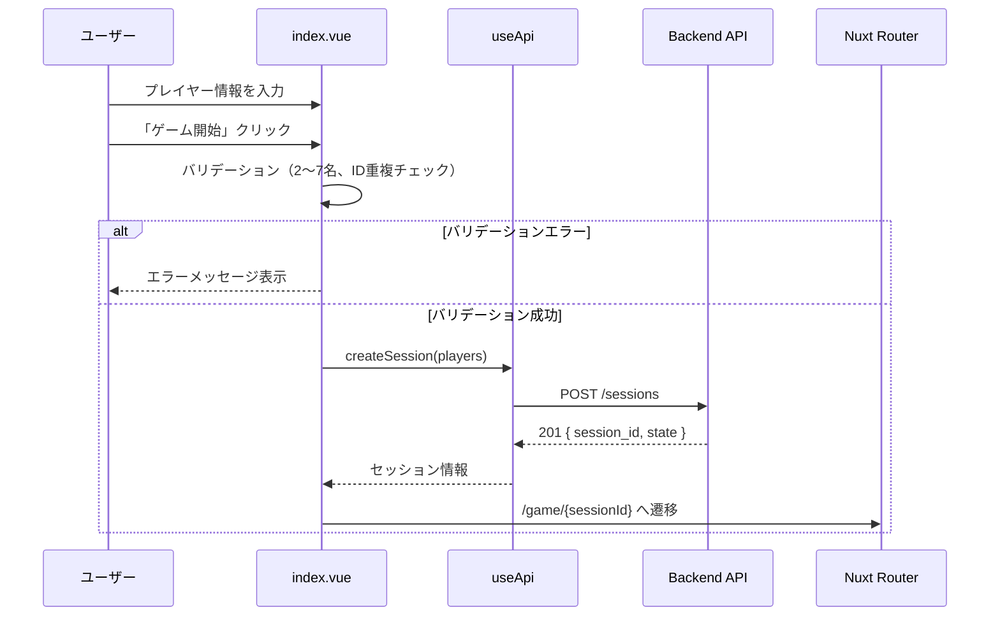
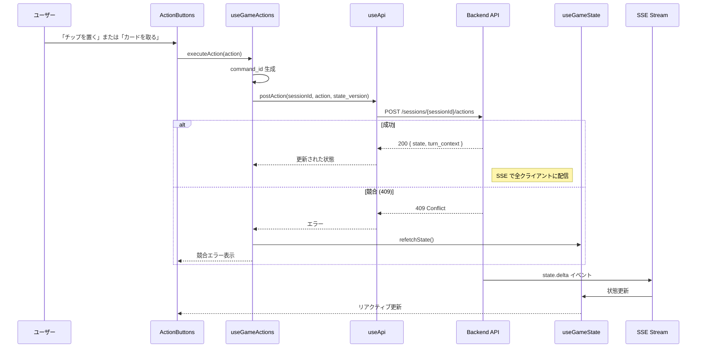
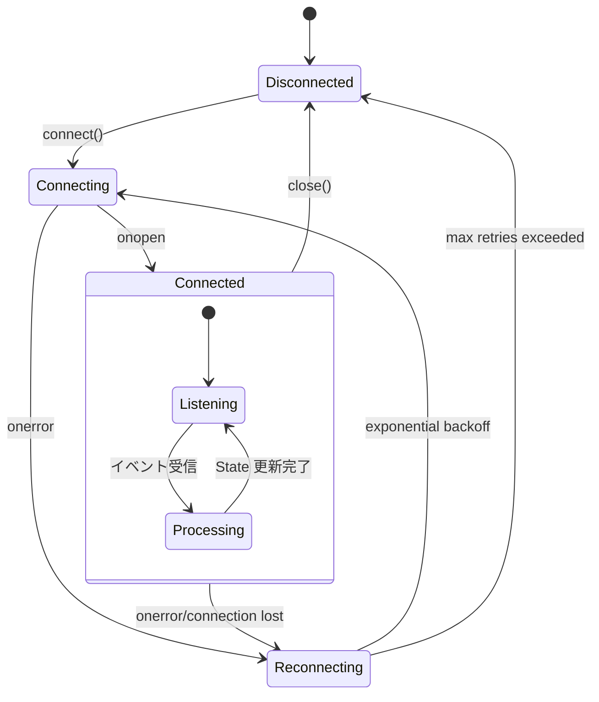
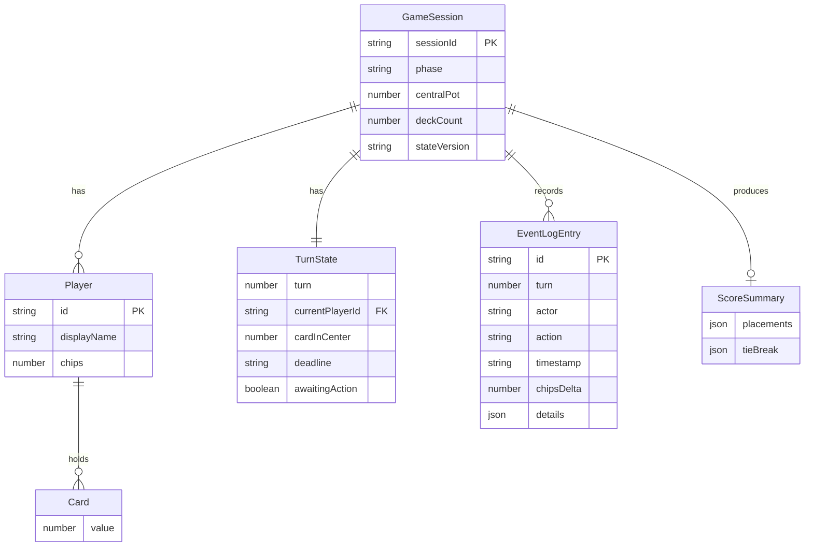

# Design Document: ゲシェンク ボードゲーム フロントエンド

## Overview

**Purpose**: ボードゲーム「ゲシェンク (Geschenkt / No Thanks!)」のウェブフロントエンドを提供し、プレイヤーがリアルタイムでゲームをプレイできる体験を実現する。

**Users**: ゲシェンクをプレイしたい2〜7名のプレイヤーが、同一ネットワーク上またはインターネット経由でゲームセッションに参加し、ターン制のゲームを進行する。

**Impact**: 既存のバックエンド API（Hono ベース）と連携し、Nuxt 3 フロントエンドからセッション作成、アクション実行、リアルタイム状態同期を行う。

### Goals

- Hono RPC クライアントを使用した型安全なバックエンド通信
- SSE によるリアルタイムゲーム状態同期
- レスポンシブで直感的なゲーム UI
- TypeScript strict mode による堅牢な型安全性

### Non-Goals

- ユーザー認証・アカウント管理（現フェーズではセッションベースのみ）
- ゲームロジックのフロントエンド実装（バックエンドに委譲）
- オフライン対応
- 国際化（日本語のみ）

---

## Architecture

### Architecture Pattern & Boundary Map



**Architecture Integration**:

- **Selected pattern**: Composables + useState による状態管理。Nuxt 3 のビルトイン機能を活用し、外部依存なしでロジックの再利用性と型安全性を両立
- **Domain boundaries**:
  - Pages: ルーティングとレイアウト
  - Components: UI 表示ロジック
  - Composables: API 通信、SSE 管理、ビジネスロジック、グローバル状態管理
- **Existing patterns preserved**: Nuxt 3 の Auto-import、Vue 3 Composition API
- **Steering compliance**: TypeScript strict mode、ESLint/Prettier による品質維持

### Technology Stack

| Layer              | Choice / Version           | Role in Feature                       | Notes                      |
| ------------------ | -------------------------- | ------------------------------------- | -------------------------- |
| Frontend Framework | Nuxt 3.19+                 | SPA モード、ルーティング、Auto-import | SSR は無効                 |
| UI Framework       | Vue 3.5+                   | Composition API によるリアクティブ UI | `<script setup>` 記法      |
| State Management   | useState (Nuxt 3 built-in) | ゲーム状態のグローバル管理            | SSR/CSR 対応、外部依存なし |
| API Client         | Hono RPC (hono/client)     | 型安全なバックエンド通信              | `hc<AppType>`              |
| Real-time          | EventSource (native)       | SSE によるリアルタイム更新            | 再接続ロジック自前実装     |
| Styling            | TailwindCSS                | レスポンシブデザイン                  | インストール済み           |

**状態管理の選択理由**:

`research.md` では Pinia を検討したが、以下の理由から useState を採用:

1. **外部依存の削減**: Pinia の追加インストールが不要
2. **シンプルさ**: ゲーム状態は単一セッションに閉じており、複雑なモジュール分割が不要
3. **SSR/CSR 互換**: useState は Nuxt のビルトイン機能で SPA モードでも正常動作
4. **スコープ**: 本機能は「1 ブラウザ = 1 セッション参加」で、グローバル状態の複雑性が限定的

---

## マルチプレイヤー参加設計

### プレイヤー識別方式

本システムは「個別デバイス方式」を採用する。各プレイヤーが自分のデバイスからネットワーク越しに参加するモデル。

```mermaid
flowchart LR
    A[セッション作成者] -->|URL + playerId 共有| B[各プレイヤー]
    B --> C[/game/sessionId?playerId=xxx]
    C --> D[自分のプレイヤーとして参加<br/>手番時のみ操作可能]
```

**設計決定**:

| 項目           | 方式                                                              | 理由                                              |
| -------------- | ----------------------------------------------------------------- | ------------------------------------------------- |
| 参加方法       | URL + クエリパラメータ（`/game/{sessionId}?playerId={playerId}`） | シンプル、認証不要、各プレイヤーに固有 URL を配布 |
| プレイヤー識別 | URL の `playerId` パラメータで識別                                | 認証なしで個別デバイス参加を実現                  |
| 観戦           | `playerId` なしでアクセスすると観戦モード                         | SSE で状態をリアルタイム受信、操作不可            |
| アクション制御 | 自分が手番かつ `playerId` が一致する場合のみボタン有効            | サーバーサイドでも `playerId` を検証              |

**実装方針**:

1. **セッション作成時**: 作成者のブラウザに `playerId` を localStorage に保存し、ゲーム画面へ遷移
2. **URL 共有**: 各プレイヤーに `?playerId={playerId}` 付きの URL を配布（セッション作成画面で表示）
3. **ゲーム画面アクセス時**:
   - URL に `playerId` がある場合 → そのプレイヤーとして参加、localStorage に保存
   - `playerId` がない場合 → 観戦モード（ボタン非表示）
4. **手番制御**: `currentPlayerId === myPlayerId` の場合のみアクションボタンを有効化
5. **セキュリティ**: バックエンド API で `playerId` とアクション実行者の一致を検証

**セッション作成後の共有 UI**:

セッション作成成功時に、各プレイヤー用の参加 URL を表示:

```
プレイヤー1 (Alice): https://example.com/game/abc123?playerId=player1
プレイヤー2 (Bob):   https://example.com/game/abc123?playerId=player2
...
```

**将来の拡張**:

- QR コード表示で簡単に URL 共有
- 招待リンクの有効期限設定

---

## System Flows

### セッション作成フロー



### ゲームプレイフロー（アクション実行）



### SSE 接続・再接続フロー



---

## Requirements Traceability

| Requirement  | Summary                            | Components             | Interfaces                | Flows                |
| ------------ | ---------------------------------- | ---------------------- | ------------------------- | -------------------- |
| 1.1          | プレイヤー情報入力・セッション作成 | SessionForm, index.vue | useApi.createSession      | セッション作成フロー |
| 1.2          | 作成成功時のゲーム画面遷移         | index.vue              | Nuxt Router               | セッション作成フロー |
| 1.3, 1.4     | バリデーション（人数、ID重複）     | SessionForm            | validatePlayers           | セッション作成フロー |
| 1.5          | Hono RPC クライアント使用          | useApi                 | hc<AppType>               | 全 API 通信          |
| 2.1-2.6      | ゲーム状態表示                     | GameBoard, PlayerPanel | useGameState              | -                    |
| 2.7          | ターン制限時間表示                 | TurnTimer              | useGameState.deadline     | -                    |
| 3.1, 3.2     | アクション実行                     | ActionButtons          | useGameActions            | ゲームプレイフロー   |
| 3.3, 3.6     | ボタン無効化条件                   | ActionButtons          | useGameState              | -                    |
| 3.4          | 競合エラー処理                     | useGameActions         | handleConflict            | ゲームプレイフロー   |
| 3.5          | command_id 冪等制御                | useGameActions         | generateCommandId         | ゲームプレイフロー   |
| 4.1          | SSE 接続確立                       | useGameStream          | EventSource               | SSE 接続フロー       |
| 4.2-4.4, 4.7 | SSE イベント処理                   | useGameStream          | onStateUpdate, onEventLog | SSE 接続フロー       |
| 4.5, 4.6     | SSE 再接続                         | useGameStream          | reconnect, lastEventId    | SSE 接続フロー       |
| 5.1-5.6      | 結果表示                           | ResultScreen           | useGameState.finalResults | -                    |
| 5.7 (追加)   | ログエクスポート（CSV/JSON）       | ResultScreen           | useApi (logs/export)      | -                    |
| 6.1-6.4      | ルールヒント表示                   | HintPanel              | useApi.getHint            | -                    |
| 7.1-7.4      | イベントログ表示                   | EventLog               | useGameState.eventLog     | -                    |
| 8.1-8.6      | UI/UX 基本要件                     | 全コンポーネント       | -                         | -                    |

---

## Components and Interfaces

### Summary Table

| Component      | Domain/Layer | Intent                    | Req Coverage     | Key Dependencies               | Contracts      |
| -------------- | ------------ | ------------------------- | ---------------- | ------------------------------ | -------------- |
| useApi         | Composables  | Hono RPC クライアント提供 | 1.5              | AppType (P0)                   | Service        |
| useGameStream  | Composables  | SSE 接続管理              | 4.1-4.7          | useGameState (P0)              | Service, Event |
| useGameActions | Composables  | アクション実行ロジック    | 3.1-3.5          | useApi (P0), useGameState (P0) | Service        |
| useGameState   | Composables  | ゲーム状態管理            | 2.1-2.7, 7.1-7.4 | -                              | State          |
| SessionForm    | Components   | セッション作成フォーム    | 1.1, 1.3, 1.4    | useApi (P0)                    | -              |
| GameBoard      | Components   | ゲーム盤面表示            | 2.1-2.6          | useGameState (P0)              | -              |
| PlayerPanel    | Components   | プレイヤー情報表示        | 2.3-2.5          | useGameState (P0)              | -              |
| ActionButtons  | Components   | アクションボタン          | 3.1-3.3, 3.6     | useGameActions (P0)            | -              |
| TurnTimer      | Components   | ターンタイマー表示        | 2.7              | useGameState (P0)              | -              |
| EventLog       | Components   | イベントログ表示          | 7.1-7.4          | useGameState (P0)              | -              |
| ResultScreen   | Components   | 結果表示                  | 5.1-5.6          | useGameState (P0)              | -              |
| HintPanel      | Components   | ルールヒント表示          | 6.1-6.4          | useApi (P1)                    | -              |

---

### Composables Layer

#### useApi

| Field        | Detail                                                             |
| ------------ | ------------------------------------------------------------------ |
| Intent       | Hono RPC クライアントインスタンスを提供し、型安全な API 通信を実現 |
| Requirements | 1.5                                                                |

**Responsibilities & Constraints**

- `hc<AppType>` で生成したクライアントを提供
- 環境変数からベース URL を取得
- 各コンポーネントは返却されたクライアントを直接使用

**Dependencies**

- External: `hono/client` — RPC クライアント生成 (P0)
- External: `@backend/index` — AppType 型定義 (P0)

**Contracts**: Service [x]

##### Service Interface

```typescript
import type { AppType } from '@backend/index';
import { hc } from 'hono/client';

type ApiClient = ReturnType<typeof hc<AppType>>;

function useApi(): ApiClient;
```

**Implementation Notes**

- ベース URL は `useRuntimeConfig().public.apiBase` から取得
- `hc<AppType>(baseUrl)` を返却するのみのシンプルな実装
- 呼び出し側で `client.sessions.$post(...)` のように直接 API を呼び出す

**Backend Type Definition Setup**

バックエンド型定義は TypeScript パスエイリアスで参照する：

1. **`nuxt.config.ts`** に追加：

   ```typescript
   alias: {
     '@backend': '../backend/src'
   }
   ```

2. **`tsconfig.json`** に追加：

   ```json
   {
     "compilerOptions": {
       "paths": {
         "@backend/*": ["../backend/src/*"]
       }
     }
   }
   ```

3. **`package.json`** に `hono` を追加（型定義用）：
   ```json
   {
     "dependencies": {
       "hono": "^4.x"
     }
   }
   ```

**注意**: `import type` で型のみをインポートするため、バックエンドコードはバンドルされない

**実装前の PoC 確認事項**:

型参照が正しく機能することを確認するため、実装初期に以下を検証:

1. `nuxt.config.ts` のエイリアス設定で `../backend/src` を解決可能か
2. `nuxi typecheck` が `import type { AppType }` を正しく解決するか
3. `nuxt build` でバックエンドコードがバンドルに含まれないか

代替案として、型参照が困難な場合は OpenAPI スキーマから `openapi-typescript` で型生成する方式に切り替え可能。

---

#### useGameStream

| Field        | Detail                                           |
| ------------ | ------------------------------------------------ |
| Intent       | SSE 接続を管理し、リアルタイムでゲーム状態を更新 |
| Requirements | 4.1, 4.2, 4.3, 4.4, 4.5, 4.6, 4.7                |

**Responsibilities & Constraints**

- EventSource の接続・切断ライフサイクル管理
- 各イベントタイプのハンドリング
- 再接続ロジック（exponential backoff）
- `lastEventId` による欠落イベント回復

**Dependencies**

- Inbound: GamePage — 接続開始/停止指示 (P0)
- Outbound: useGameState — 状態更新 (P0)
- External: EventSource API — SSE 接続 (P0)

**Contracts**: Service [x] / Event [x]

##### Service Interface

```typescript
interface UseGameStreamOptions {
  sessionId: string;
  onConnect?: () => void;
  onDisconnect?: () => void;
  onError?: (error: Event) => void;
}

interface UseGameStreamReturn {
  /** 接続状態 */
  status: Ref<'disconnected' | 'connecting' | 'connected' | 'reconnecting'>;

  /** 接続開始 */
  connect: () => void;

  /** 接続終了 */
  disconnect: () => void;

  /** 最後に受信したイベント ID */
  lastEventId: Ref<string | null>;
}

function useGameStream(options: UseGameStreamOptions): UseGameStreamReturn;
```

##### Event Contract

- **Subscribed events**:
  - `state.delta`: ゲーム状態更新 → `useGameState().updateState()`
  - `state.final`: ゲーム終了 → `useGameState().setFinalResults()`
  - `event.log`: イベントログ追加 → `useGameState().appendEventLog()`
  - `rule.hint`: ヒント更新 → `useGameState().updateHint()`
  - `system.error`: エラー通知 → エラートースト表示
- **Ordering / delivery guarantees**: `Last-Event-ID` による順序保証

**Implementation Notes**

- 再接続は 1s, 2s, 4s, 8s, 16s の exponential backoff、最大5回
- `onbeforeunload` で接続をクリーンアップ

---

#### useGameActions

| Field        | Detail                                 |
| ------------ | -------------------------------------- |
| Intent       | ゲームアクションの実行と冪等制御を担当 |
| Requirements | 3.1, 3.2, 3.3, 3.4, 3.5, 3.6           |

**Responsibilities & Constraints**

- アクション実行前のバリデーション
- `command_id` の生成と管理
- 競合エラー時の状態再取得

**Dependencies**

- Inbound: ActionButtons — アクション実行要求 (P0)
- Outbound: useApi — API 呼び出し (P0)
- Outbound: useGameState — 状態参照・更新 (P0)

**Contracts**: Service [x]

##### Service Interface

```typescript
interface UseGameActionsReturn {
  /** アクション実行中フラグ */
  isExecuting: Ref<boolean>;

  /** 最後のエラー */
  lastError: Ref<ActionError | null>;

  /** チップを置くアクション */
  placeChip: (playerId: string) => Promise<boolean>;

  /** カードを取るアクション */
  takeCard: (playerId: string) => Promise<boolean>;

  /** アクション可能判定 */
  canPlaceChip: (playerId: string) => boolean;
  canTakeCard: (playerId: string) => boolean;
}

type ActionError = {
  code: string;
  message: string;
  /** ユーザーが次に取るべき対処を示す理由コード（例: REQUEST_INVALID） */
  reasonCode: string;
  /** ユーザー向けの具体的な再入力・再試行手順 */
  instruction: string;
  isConflict: boolean;
};

/** アクション成功時のターンコンテキスト（即時 UI 更新用） */
interface TurnContext {
  turn: number;
  currentPlayerId: string;
  cardInCenter: number | null;
  awaitingAction: boolean;
  centralPot: number;
  chips: Record<string, number>;
}

function useGameActions(sessionId: string): UseGameActionsReturn;
```

**Implementation Notes**

- `command_id` は `crypto.randomUUID()` で生成
- 競合（409）時は自動で最新状態を取得し再試行を促す
- アクション成功時、レスポンスの `turn_context` を使って SSE 到達前に即時 UI 更新（レスポンシブな UX）

---

#### useGameState

| Field        | Detail                                                                         |
| ------------ | ------------------------------------------------------------------------------ |
| Intent       | Nuxt useState を使用してゲーム状態をグローバルに管理し、コンポーネント間で共有 |
| Requirements | 2.1-2.7, 5.1-5.6, 7.1-7.4                                                      |

**Responsibilities & Constraints**

- ゲームスナップショットの保持
- 派生状態（現在プレイヤー、アクション可否など）の算出
- イベントログの管理
- Nuxt の useState を使用した SSR/CSR 対応のグローバル状態管理

**Dependencies**

- Inbound: useGameStream — 状態更新 (P0)
- Inbound: Components — 状態参照 (P0)
- External: `useState` (Nuxt 3 built-in) — グローバル状態管理 (P0)

**Contracts**: State [x]

##### Service Interface

```typescript
interface GameState {
  /** セッション ID */
  sessionId: string | null;

  /** 自分のプレイヤー ID（観戦モードの場合は null） */
  myPlayerId: string | null;

  /** 状態バージョン（楽観的排他制御用） */
  stateVersion: string | null;

  /** ゲームフェーズ */
  phase: 'setup' | 'running' | 'completed' | null;

  /** 中央カード */
  cardInCenter: number | null;

  /** 中央ポットのチップ数 */
  centralPot: number;

  /** 山札の残り枚数 */
  deckCount: number;

  /** 現在の手番プレイヤー ID */
  currentPlayerId: string | null;

  /** ターン制限時刻 */
  deadline: string | null;

  /** プレイヤー一覧 */
  players: Array<{
    id: string;
    displayName: string;
    chips: number;
    cards: number[];
  }>;

  /** イベントログ */
  eventLog: EventLogEntry[];

  /** 最終結果 */
  finalResults: ScoreSummary | null;

  /** 現在のヒント */
  currentHint: RuleHint | null;
}

interface UseGameStateReturn {
  /** ゲーム状態（リアクティブ） */
  state: Ref<GameState>;

  /** 自分のプレイヤー ID を設定 */
  setMyPlayerId: (playerId: string | null) => void;

  /** 状態を初期化 */
  initSession: (
    sessionId: string,
    snapshot: GameSnapshot,
    version: string,
  ) => void;

  /** 状態を更新 */
  updateState: (snapshot: GameSnapshot, version: string) => void;

  /** 自分が手番プレイヤーか（computed） */
  isMyTurn: ComputedRef<boolean>;

  /** 自分のチップ数（computed） */
  myChips: ComputedRef<number>;

  /** 最終結果を設定 */
  setFinalResults: (results: ScoreSummary) => void;

  /** イベントログを追加 */
  appendEventLog: (entry: EventLogEntry) => void;

  /** ヒントを更新 */
  updateHint: (hint: RuleHint) => void;

  /** 状態をクリア */
  reset: () => void;

  /** 手番プレイヤーか判定 */
  isCurrentPlayer: (playerId: string) => boolean;

  /** チップを置けるか判定 */
  canPlaceChip: (playerId: string) => boolean;

  /** ゲーム終了済みか（computed） */
  isGameOver: ComputedRef<boolean>;
}

function useGameState(): UseGameStateReturn;
```

**Implementation Notes**

- `useState<GameState>('game-state', () => initialState)` でグローバル状態を定義
- 初期状態は composable 内で定義し、SSR/CSR で一貫した動作を保証
- computed プロパティは `useGameState()` 呼び出し時に算出

**Persistence & Consistency**:

- メモリ内のみ（セッション終了で破棄）
- SSE イベントによる単方向更新（サーバーが正）

---

### Components Layer

#### SessionForm

| Field        | Detail                                             |
| ------------ | -------------------------------------------------- |
| Intent       | ゲームセッション作成のためのプレイヤー入力フォーム |
| Requirements | 1.1, 1.3, 1.4                                      |

**Responsibilities & Constraints**

- 2〜7名のプレイヤー情報入力 UI
- クライアントサイドバリデーション
- 送信状態の管理

**Implementation Notes**

- 動的にプレイヤー入力フィールドを追加/削除
- バリデーションエラーはフィールド単位で表示

---

#### GameBoard

| Field        | Detail                                               |
| ------------ | ---------------------------------------------------- |
| Intent       | ゲーム盤面全体を表示（中央カード、ポット、山札残数） |
| Requirements | 2.1, 2.2, 2.6                                        |

**Responsibilities & Constraints**

- 中央カードの数字を大きく表示
- ポットのチップ数をアイコンで視覚化
- 山札の残り枚数を表示

---

#### PlayerPanel

| Field        | Detail                                           |
| ------------ | ------------------------------------------------ |
| Intent       | 各プレイヤーの情報（チップ数、獲得カード）を表示 |
| Requirements | 2.3, 2.4, 2.5                                    |

**Responsibilities & Constraints**

- プレイヤーごとのチップ数表示
- 獲得カードを連番グループで表示
- 現在の手番プレイヤーをハイライト

---

#### ActionButtons

| Field        | Detail                                           |
| ------------ | ------------------------------------------------ |
| Intent       | 「チップを置く」「カードを取る」アクションボタン |
| Requirements | 3.1, 3.2, 3.3, 3.6                               |

**Responsibilities & Constraints**

- 自分が手番でない場合は無効化
- チップ0枚時は「チップを置く」を無効化
- 実行中はローディング表示
- 観戦モード（`myPlayerId` が null）では非表示

**Props Interface**

```typescript
interface ActionButtonsProps {
  /** 自分のプレイヤー ID（観戦モードの場合は null） */
  myPlayerId: string | null;
  /** 手番プレイヤー ID */
  currentPlayerId: string | null;
  /** 自分のチップ数 */
  myChips: number;
}
```

---

#### TurnTimer

| Field        | Detail                             |
| ------------ | ---------------------------------- |
| Intent       | ターン制限時間のカウントダウン表示 |
| Requirements | 2.7                                |

**Responsibilities & Constraints**

- `deadline` から残り時間を計算して表示
- 残り時間が少ない場合は警告色で表示

---

#### EventLog

| Field        | Detail                       |
| ------------ | ---------------------------- |
| Intent       | ゲーム中のイベント履歴を表示 |
| Requirements | 7.1, 7.2, 7.3, 7.4           |

**Responsibilities & Constraints**

- ターン順にイベントを表示
- アクター、アクション、時刻を表示
- 新規イベントは自動スクロール

---

#### ResultScreen

| Field        | Detail                       |
| ------------ | ---------------------------- |
| Intent       | ゲーム終了時の結果を表示     |
| Requirements | 5.1, 5.2, 5.3, 5.4, 5.5, 5.6 |

**Responsibilities & Constraints**

- 順位、スコア、獲得カードを表示
- カードセットを視覚的にグループ化
- タイブレーク情報を表示（該当時）
- 新しいゲーム開始ボタンを提供
- イベントログのエクスポート機能（CSV / JSON）を提供
  - `GET /sessions/{sessionId}/logs/export.csv`
  - `GET /sessions/{sessionId}/logs/export.json`

---

#### HintPanel

| Field        | Detail                               |
| ------------ | ------------------------------------ |
| Intent       | 現在の状況に基づくルールヒントを表示 |
| Requirements | 6.1, 6.2, 6.3, 6.4                   |

**Responsibilities & Constraints**

- ヒント取得ボタンを提供
- ヒントテキストを表示
- `warning` 強調度は警告スタイルで表示

---

## Data Models

### Domain Model



### Logical Data Model

**GameSnapshot** (バックエンドから受信):

- セッション全体の状態を表現
- `phase`: ゲーム進行状態 ('setup' | 'running' | 'completed')
- `turnState`: 現在のターン情報
- `players`: プレイヤー一覧と表示名
- `chips`: プレイヤーごとの所持チップ数
- `hands`: プレイヤーごとの獲得カード
- `centralPot`: 中央ポットのチップ数
- `deck`: 山札（フロントエンドでは length のみ使用）

**EventLogEntry**:

- `id`: イベント一意識別子
- `turn`: ターン番号
- `actor`: アクター（プレイヤー ID または 'system'）
- `action`: アクション種別
- `timestamp`: ISO 8601 形式の時刻
- `chipsDelta`: チップ増減（オプション）
- `details`: 追加メタデータ（オプション、任意のキー・値ペア）

---

## Error Handling

### Error Strategy

- API エラーはステータスコードに応じて分類
- ユーザー向けの日本語メッセージを生成
- 競合エラー（409）は自動リカバリを試行

### Error Categories and Responses

**User Errors (4xx)**:

- 422 バリデーションエラー → フィールド単位でエラーメッセージ表示
- 404 セッション未存在 → トップページへ誘導

**System Errors (5xx)**:

- 500 サーバーエラー → 「しばらく待ってから再試行してください」表示
- SSE 接続エラー → 自動再接続、最大試行後は手動再接続ボタン

**Business Logic Errors (409)**:

- state_version 競合 → 最新状態を取得し「他のプレイヤーがアクションしました」表示

### Monitoring

- コンソールログでエラー詳細を出力
- SSE 接続状態を UI に表示

---

## Testing Strategy

### Unit Tests

- `useApi`: 各 API メソッドのリクエスト/レスポンス型検証
- `useGameState`: 状態更新ロジック、computed プロパティの算出
- `useGameActions`: アクション実行可否判定、command_id 生成

### Integration Tests

- `useGameStream`: SSE イベント受信と Store 更新の連携
- SessionForm → useApi → Router の遷移フロー

### E2E Tests

- セッション作成からゲーム終了までの一連のフロー
- 複数タブでの同時プレイシミュレーション
- SSE 再接続シナリオ

---

## Security Considerations

- CORS: バックエンドで許可オリジンを設定済み
- XSS: Vue の自動エスケープを活用、`v-html` は使用しない
- セッション ID は URL パラメータで公開（リンク共有でセッション参加）

---

## Performance & Scalability

- **SSE 接続数**: ブラウザごとに1接続、セッションごとに最大7接続想定
- **状態サイズ**: GameSnapshot は数KB、パフォーマンス影響なし
- **再レンダリング**: Vue の computed による最適化、useState のリアクティビティを活用
